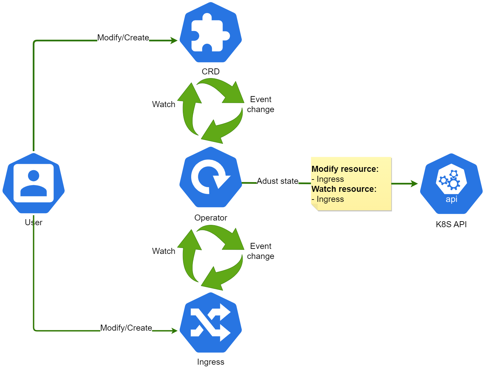

# nimble-opti-adapter

<p><i>The Nimble-Opti-Adapter is a dedicated Kubernetes operator engineered to handle specific use cases. It's targeted towards Kubernetes clusters that have already integrated the Cert-Manager operator and Nginx-Ingress controller, and use Let's Encrypt as their certificate authority for acquiring SSL certificates validated through the `acme.cert-manager.io/http01-edit-in-place: true` annotation in the ingress. Moreover, the ingress requires the `nginx.ingress.kubernetes.io/backend-protocol: HTTPS` annotation to ensure service accessibility. The operator proficiently addresses the issue of auto-renewal of certificates in this scenario, given that the HTTP01 Ingress resolver doesn't align with this setup.
</i></p>

<p align="center">
  <!--  -->
  
</p>

<p align="center">
  <!-- <a href="https://github.com/uri-tech/nimble-opti-adapter/actions">
    
  </a> -->
  <a href="https://github.com/uri-tech/nimble-opti-adapter/blob/master/LICENSE">
    
  </a>
  <a href="https://github.com/uri-tech/nimble-opti-adapter/releases">
    
  </a>
  <a href="https://github.com/uri-tech/nimble-opti-adapter/issues">
    
  </a>
</p>

nimble-opti-adapter is a Kubernetes operator that automates certificate renewal management when using ingress with the annotation `cert-manager.io/cluster-issuer` for services that require TLS communication. This operator is designed to work seamlessly with the NGINX ingress controller, efficiently handling the `nginx.ingress.kubernetes.io/backend-protocol: HTTPS` annotation.

## ⚙️ Operator Workflow

The operator monitors the creation and modification of both CustomResourceDefinitions (CRDs) of kind `NimbleOpti` and Ingress resources. The following is a detailed overview of the operator's behavior:

1. 🚫 The operator is currently configured to watch for creation or modification events on `NimbleOpti` CRDs and `ingress`.

2. 🚦 Upon Ingress resource events, the operator verifies the existence of the `nimble.opti.adapter/enabled: "true"` label:
   - In the absence of this label, the operator remains passive.
   - If the label is present, it validates the existence of a `NimbleOpti` CRD within the same namespace. 
     - If the CRD is missing, a new `NimbleOpti` CRD is instantiated with default values. 
     - If the CRD already exists, the operator scans for any path in `spec.rules[].http.paths[].path` containing `.well-known/acme-challenge`.
       - If found, the certificate renewal process for the Ingress resource is triggered.

3. 📆 The operator runs a daily audit of all Ingress resources with the `nimble.opti.adapter/enabled: "true"` label and associated `NimbleOpti` CRD in the same namespace:
   - In the absence of matching resources, no action is taken.
   - If matches are found, the operator fetches the associated Secret referenced in `spec.tls[].secretName` for each tls[], calculates the remaining time until certificate expiry and checks it against the `CertificateRenewalThreshold` specified in the `NimbleOpti` CRD. If the certificate is due to expire within or on the threshold, certificate renewal is initiated.

4. 🔄 The certificate renewal process involves the following steps:
   - The `nginx.ingress.kubernetes.io/backend-protocol: HTTPS` annotation is temporarily stripped from the Ingress resource.
   - A timer kicks in, waiting for the absence of `spec.rules[].http.paths[].path` containing `.well-known/acme-challenge` or for the lapse of the `AnnotationRemovalDelay` specified in the `NimbleOpti` CRD.
   - The duration of annotation updates during renewal is captured as `nimble-opti-adapter_annotation_updates_duration_seconds` and dispatched to a Prometheus endpoint.
   - The `nginx.ingress.kubernetes.io/backend-protocol: HTTPS` annotation is reinstated on the Ingress resource.
   - If the  `.well-known/acme-challenge` is not exist then counter `nimble-opti-adapter_certificate_renewals_total` is incremented and sent to a Prometheus endpoint.
<!--  -->

## 🌟 Features

- 🔄 Automatic certificate renewal based on certificate validity and user-defined waiting times
- 🏷️ Supports multi-namespace operation with a configurable label selector
- 📊 Prometheus metrics collection for certificate renewals and annotation updates
- 🚀 Easy installation using Helm
- 🔌 Extensible architecture for future enhancements

## ⏳ Future Enhancements

- 🔔 Customizable alerting and notification system for certificate renewals and errors
- 🔗 Integration with external certificate issuers or other certificate management systems
- 📈 Enhanced Prometheus metrics for deeper insights into certificate management
- 🚦 Support for other ingress controllers besides NGINX
- 📝 Automatic handling of additional ingress annotations as needed

## 📚 Prerequisites

- Kubernetes cluster (v1.16+)
- [Helm (v3+)](https://helm.sh/docs/intro/install)
- [Cert-Manager operator](https://github.com/cert-manager/cert-manager)
- [Ingress NGINX Controller](https://github.com/kubernetes/ingress-nginx)

## 🚀 Quick Start

This configuration assumes you are working from a Linux Shell or macOS.

### Step 1: Clone the repository

```bash
git clone https://github.com/uri-tech/nimble-opti-adapter.git
cd nimble-opti-adapter
```

### Step 2: Install the operator using Helm

```bash
helm install nimble-opti-adapter ./helm/nimble-opti-adapterconfig
```

### Step 3: Modify the operator

To modify the operator, edit the Helm chart templates or values.yaml file in the helm/nimble-opti-adapterconfig directory.

### Step 4: Update the operator using Helm

Repackage the Helm chart and upgrade the release with the following commands:

```bash
cd nimble-opti-adapter/helm/
helm package nimble-opti-adapterconfig
helm upgrade nimble-opti-adapter ./nimble-opti-adapterconfig-0.1.0.tgz
```

## ⚙️ Configuration

Edit the `values.yaml` file in the `helm/nimble-opti-adapterconfig` directory to customize the following parameters:

- `labelSelector`: The label selector for namespaces the operator will manage certificates in (default: `nimble.opti.adapter/enabled: 'true'`)
- `certificateRenewalThreshold`: The waiting time (in days) before the certificate expires to trigger renewal
- `annotationRemovalDelay`: The delay (in seconds) after removing the `nginx.ingress.kubernetes.io/backend-protocol: HTTPS` annotation before re-adding it

## 📝 Usage

Label the Ingress where the operator should manage certificates:

```yaml
apiVersion: v1
kind: Ingress
metadata:
  name: your-target-ingress
  labels:
    nimble.opti.adapter/enabled: "true"
```

Create a nimble-opti-adapter custom resource in any namespace:

```yaml
apiVersion: nimble-opti-adapter.example.com/v1alpha1
kind: NimbleOpti
metadata:
  name: example-config
spec:
  certificateRenewalThreshold: 30
  annotationRemovalDelay: 60
```

## 📊 Metrics

nimble-opti-adapter exposes the following Prometheus metrics:

- `nimble-opti-adapter_certificate_renewals_total`: Total number of certificate renewals
- `nimble-opti-adapter_annotation_updates_duration_seconds`: Duration (in seconds) of annotation updates during each renewal

## 🤝 Contributing

We welcome contributions to the nimble-opti-adapter project! Please see the [CONTRIBUTING.md](CONTRIBUTING.md) file for more information on how to contribute.

## 📜 License

nimble-opti-adapter is licensed under the [Apache License, Version 2.0](LICENSE).

## 📞 Support

For any questions, bug reports, or feature requests, please open an issue on our [GitHub repository](https://github.com/uri-tech/nimble-opti-adapter/issues).

<!-- ## Attribution

### Images

Diagram: [Unsplash](https://unsplash.com/photos/U9s5m5L2Gn0) (License: CC0) -->

<!-- git pull --allow-unrelated-histories https://github.com/uri-tech/nimble-opti-adapter main -->

<!-- kubebuilder init --domain nimble-opti-adapter.tech-ua.com --repo github.com/uri-tech/nimble-opti-adapter -->
