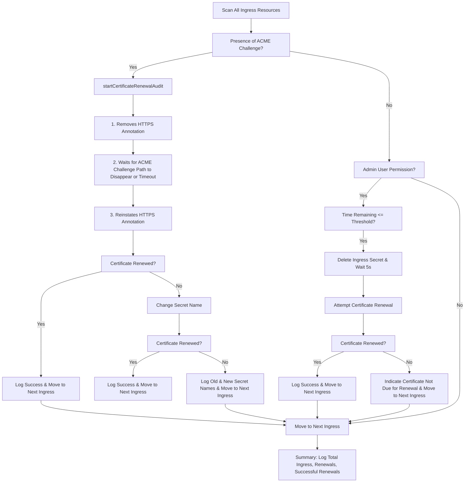

# 🚀 Ingress Annotation Modifier CronJob 🚀

Welcome to the Ingress Annotation Modifier CronJob! This tool is designed to scan and modify annotations of `Ingress` resources across all Kubernetes namespaces daily. Its primary focus is on the annotation `"nginx.ingress.kubernetes.io/backend-protocol: HTTPS"`.



## 📂 Contents

1. [Function Descriptions](#-function-descriptions-)
2. [Deployment](#-deployment-)
3. [Deployment in test environment](#-deployment-in-test-environment-)
4. [Monitoring & Logging](#-monitoring--logging-)
5. [Best Practices & Tips](#-best-practices--tips-)
6. [Configuration Insights](#-configuration-insights-)


## 🛠 Function Descriptions 🛠

### `NewIngressWatcher`
This function is the constructor for the `IngressWatcher` type. It's like the birth of our watcher! 🎉 When invoked, it sets up the necessary configurations, schemes, and clients to interact with the Kubernetes API. It's the starting point, ensuring our watcher is ready to monitor and act upon Ingress resources.

### `AuditIngressResources`
This function is the heart of our watcher. 💓 It's like a diligent detective, scanning through all Ingress resources in the cluster. For each Ingress:

- **Presence of ACME Challenge**: 
  - If the Ingress has an ACME challenge path, the function will:
    1. Initiate the certificate renewal process with the function `startCertificateRenewalAudit`.
    2. If the certificate is not renewed:
       - Try changing the secret name associated with the Ingress to prompt the `cert-manager` to create a new certificate with the function `changeIngressSecretName`.
       - If the certificate is still not renewed after changing the secret name, log the old and new secret names.
       - If the certificate is successfully renewed after changing the secret name, log the success.
  
- **Absence of ACME Challenge and Admin User Permission**: 
  - If there's no ACME challenge path but the function has admin user permissions:
    1. Calculate the time remaining before the certificate is due for renewal.
    2. If the remaining time is less than or equal to the defined threshold:
       - Delete the associated Ingress secret and wait for 5 seconds to ensure the secret has been deleted.
       - Attempt to renew the certificate.
       - If the certificate is renewed successfully, log the success. Otherwise, indicate that the certificate is not yet due for renewal.

**Summary**: At the end of its operations, `AuditIngressResources` provides logs detailing:
- The total number of Ingress resources audited.
- The number of Ingress resources that required renewal.
- The number that were successfully renewed.

This ensures a comprehensive overview and management of the Ingress resources.


### `startCertificateRenewalAudit`
This function is the certificate's guardian. 🛡️ When an Ingress contains the `.well-known/acme-challenge`, this function steps in to renew the certificate. It:
1. Removes the HTTPS annotation.
2. Waits for the ACME challenge path to disappear or for a timeout.
3. Once confirmed, it reinstates the HTTPS annotation.

The function ensures that the certificate is renewed and up-to-date, keeping the traffic secure.

### `changeIngressSecretName`
Think of this function as a name-changer. 🔄 When the certificate is about to expire, and the user doesn't have admin permissions (`ADMIN_USER_PERMISSION: "false"`), this function alters the secret's name in `ing.Spec.TLS`. By doing so, it prompts the cert-manager to create a new certificate. It checks if the name has a version suffix (like `-v1`). If not, it adds one. If it does, it increments it. It's a clever trick to get a fresh certificate without deleting the old one!

### `deleteIngressSecret`
This function is like a cleaner. 🧹 When the certificate needs renewal and the user has admin permissions (`ADMIN_USER_PERMISSION: "true"`), this function deletes the associated Ingress secret. It ensures that old, soon-to-expire certificates are removed, making way for new ones.


## 🚀 Deployment 🚀
### 🏗 Building from Scratch:

The following steps guide you through the process of cloning the repository, building the Docker container, and deploying the CronJob to your Kubernetes cluster.

#### 1. Clone the Repository:

To get started, first clone the repository to your local machine:

```
git clone https://github.com/uri-tech/nimble-opti-adapter.git
cd nimble-opti-adapter
```

#### 2. Build the Docker Container:

Before building the Docker container, ensure you have Docker installed and running on your machine. 

Build the Docker image using the provided Dockerfile:

```
docker build -t "$docker_image_name:latest" -f cronjob/Dockerfile .
```

After a successful build, push the Docker image to your preferred container registry:

```
docker push "$docker_image_name:latest"
```

**Note**: Ensure you have the necessary permissions to push images to the specified container registry. If you're using Docker Hub, replace `$docker_image_name` with your Docker Hub username and the desired image name, e.g., `username/image-name`.

#### 3. Deploy to Kubernetes Cluster:

Before deploying, ensure you have `kubectl` installed and configured to communicate with your Kubernetes cluster.

Apply the necessary RBAC permissions:

```
kubectl apply -f cronjob/deploy/default_rbac.yaml
for admin user:
kubectl apply -f cronjob/deploy/default_rbac.yaml
```
or for admin user:
```bash
kubectl apply -f cronjob/deploy/admin_rbac.yaml
```

Next, apply the configuration map which contains the CronJob's configuration:

```
kubectl apply -f cronjob/deploy/configmap.yaml
```

Finally, deploy the CronJob:

```
kubectl apply -f cronjob/deploy/cronjob.yaml
```

**Note**: Monitor the status of the CronJob using `kubectl` commands. For instance, to check the status of the CronJob, you can use:

```
kubectl get cronjobs -n ingress-modify-ns
```


#### Conclusion:

By following the above steps, you should have successfully built the Docker container from the source code and deployed the CronJob to your Kubernetes cluster. Regularly check the logs and monitor the CronJob's performance to ensure smooth operations.


## 🚀 Deployment in test environment 🚀

### 🔄 Installing/Updating the CronJob Only
###  Full Installation (including a Minikube cluster)
The `cronjob-create.sh` script provides a comprehensive setup. From initializing a Minikube cluster to applying the Kubernetes configurations, it's got you covered!

🔧 **What it does**:
- Initializes a Minikube cluster.
- Sets up Helm for cert-manager.
- Enables Minikube ingress.
- Installs cert-manager.
- Configures LetsEncrypt as a cluster issuer.
- Builds and pushes the Docker image.
- Applies the Kubernetes configurations.

🏃 **To deploy, simply run**:
```
./cronjob-create.sh
```

### 🔄 Installing/Updating the CronJob Only
The `cronjob-update.sh` script is your go-to for updating the CronJob. It's efficient, removing the old configuration and applying the new one after rebuilding the Docker image.

🔧 **What it does**:
- Removes the old configuration.
- Rebuilds and pushes the Docker image.
- Applies the updated Kubernetes configurations.

🏃 **To update, execute**:
```
./cronjob-update.sh
```

### 🛠️ Script Options:
Both scripts support the `-e` option to set environment variables. Here's how you can use it:

- **Setting the Image Tag**:
```
./cronjob-create.sh -e IMAGE_TAG=v2.0.0
./cronjob-update.sh -e IMAGE_TAG=v2.0.0
```

- **Setting the Cert Manager Version**:
```
./cronjob-create.sh -e CERT_MANAGER_VERSION=v1.12.0
```

- **Other options**:
  - `DOCKER_USERNAME`: Set the Docker username.
  - `DOCKER_IMAGE_NAME`: Specify the Docker image name.
  - `BUILD_PLATFORM`: Choose the build platform (`local` or `all`).
  - `ADMIN_CONFIG`: Set to `true` or `false` to control admin configurations.

For example, to set the Docker username while creating:
```
./cronjob-create.sh -e DOCKER_USERNAME=myusername
```

Remember, you can combine multiple environment variables by separating them with spaces:
```
./cronjob-create.sh -e IMAGE_TAG=v2.0.0 -e DOCKER_USERNAME=myusername -e CERT_MANAGER_VERSION=v1.12.0
```


## 📊 Monitoring & Logging 📊

The container provides detailed logs of its operations. You can adjust the verbosity of the logs by setting the `RUN_MODE`:

- `"dev"`: Provides a comprehensive breakdown of what's happening under the hood.
- `"prod"`: Standard logs suitable for production environments.

## 🎓 Best Practices & Tips 🎓

1. **Namespacing**: All resources are neatly organized under the `ingress-modify-ns` namespace. This ensures a tidy separation from other workloads in your cluster.
2. **Private Docker Registries**: If you're using one, remember to add image pull secrets to the service account.
3. **Resource Management**: The CronJob is configured with resource requests and limits, ensuring it gets the resources it needs without hogging cluster resources.
4. **Stay Informed**: Regularly check the logs for insights and potential issues.
5. **Graceful Error Handling**: The Go code is designed to handle errors gracefully and retries operations when necessary.

## 🌟 Configuration Insights 🌟

The `configmap.yaml` file is your go-to for tweaking the CronJob's behavior. Here are some key configurations you can adjust:

- 🔄 `RUN_MODE`: Adjust the verbosity of logs. Options include `"dev"` for detailed logs and `"prod"` for standard logs.
- 📝 `LOG_OUTPUT`: Choose between `"console"` for human-readable logs or `"json"` for structured logging.
- ⏳ `CERTIFICATE_RENEWAL_THRESHOLD`: Defines the number of days before a certificate's expiration to initiate renewal.
- ⌛ `ANNOTATION_REMOVAL_DELAY`: The delay (in seconds) to wait after removing an annotation.
